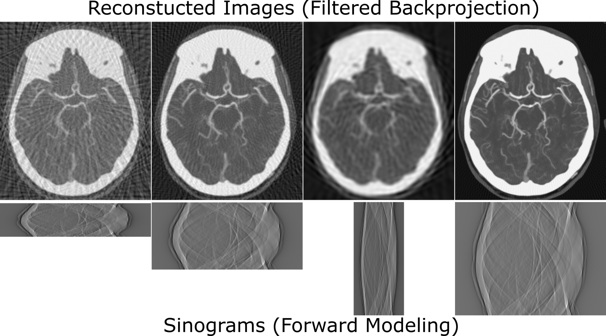
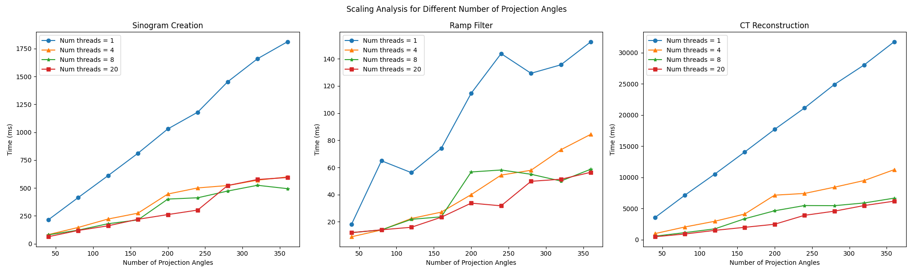
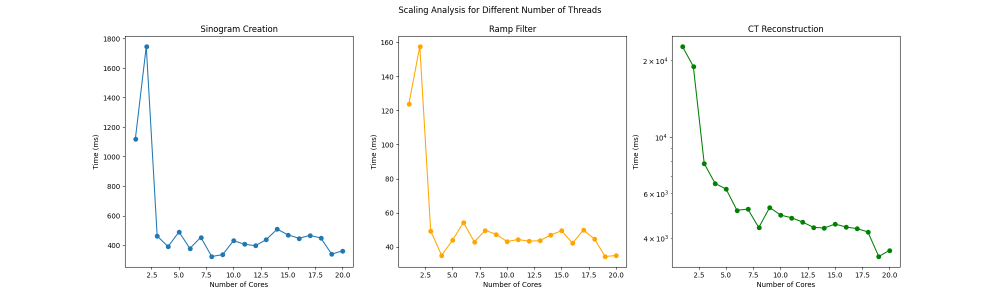
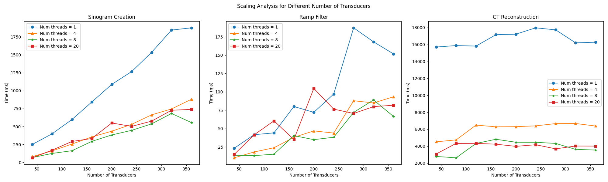
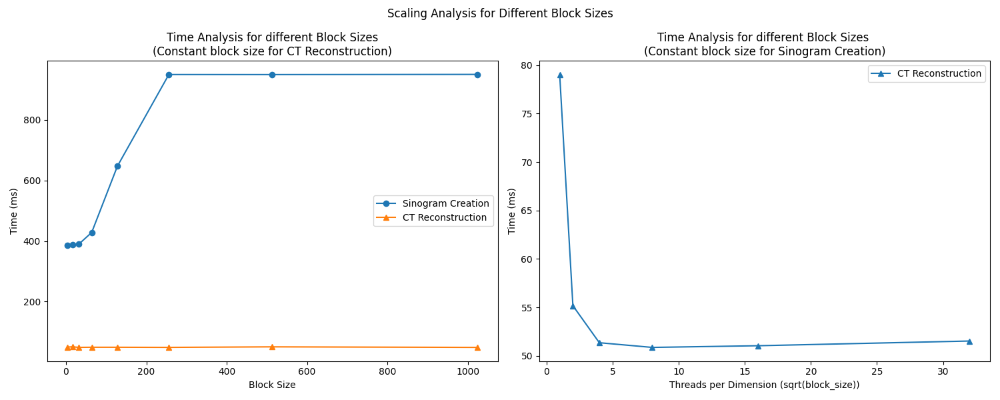
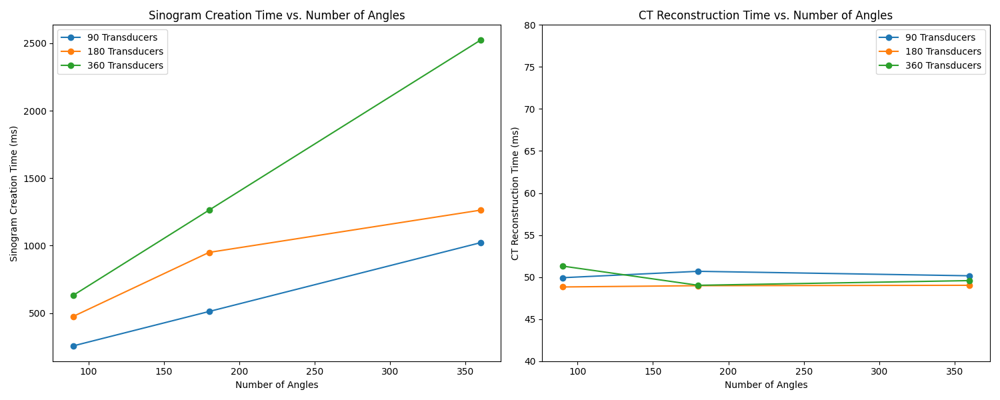

# Accelerating Computed Tomography Image Reconstruction with OpenMP and CUDA

## Overview

This project implements an accelerated Computed Tomography (CT) image reconstruction pipeline, leveraging both OpenMP for parallel CPU processing and CUDA for GPU acceleration. The pipeline takes a 2D input image (in BMP format), generates a sinogram using the Radon transform, applies an optional ramp filter in the frequency domain, and reconstructs the image using backprojection.

The goal is to overcome the computational bottlenecks inherent in CT reconstruction, enabling high-performance and scalable processing for complex imaging tasks. This leads to faster CT imaging, which benefits real-time diagnostics, resource utilization, and outcomes, especially in healthcare and industries that rely on precise imaging technologies.

## Features

### Core Functionality

*   **BMP File Handling:** Custom methods for reading and writing BMP files, avoiding external library dependencies (e.g., OpenCV).
*   **Grayscale Conversion:** Converts input RGB BMP images to grayscale for processing efficiency.
    *   **Equation:** For a pixel with RGB values (R, G, B), the grayscale value (I) is:
        ```
        I = (R + G + B) / 3
        ```

*   **Radon Transform:** Generates the sinogram from the grayscale image, representing line integrals across various angles.
    *   **Equation:** The Radon transform of an image *f(x, y)* is given by:
        ```
        R(θ, s) = ∫∫ f(x, y) δ(x cosθ + y sinθ - s) dx dy
        ```
        where *θ* is the angle, *s* is the offset, and *δ* is the Dirac delta function. This can be interpreted as line integrals across the image
*   **Bilinear Interpolation:** Uses bilinear interpolation for accurate pixel value estimation at non-integer coordinates, crucial for the Radon transform and backprojection.
    *   **Equation:** For a point (x,y), the bilinear interpolation between 4 surrounding points with values c1,c2,c3,c4 is:
        ```
        I(x,y) = c1*(1-fx)*(1-fy) + c2*fx*(1-fy) + c3*(1-fx)*fy + c4*fx*fy
        ```
        where fx and fy are fractional part of x and y.
*   **Ramp Filtering (Optional):** Applies a ramp filter in the frequency domain to eliminate blurring and enhance image sharpness by amplifying high-frequency components and suppressing low-frequency components.
    *   **Equation:** The ramp filter in the frequency domain has the response:
        ```
         H(f) = |f|
        ```
*   **Backprojection:** Reconstructs the image from filtered (or unfiltered) sinogram projections back onto the image domain.
    *   **Equation:** The backprojection of the sinogram *R(θ, s)* is given by:
        ```
        f'(x, y) = ∫ R(θ, x cosθ + y sinθ) dθ
        ```
        where *f'(x, y)* is the reconstructed image.

### Parallel Implementations

#### 1. OpenMP Implementation (CPU)

*   **Parallel Processing:** Utilizes OpenMP for parallelization of computationally intensive tasks, including sinogram creation, ramp filtering, and backprojection.
*   **Scalability:** Demonstrates significant performance improvement with an increase in CPU threads for each stage of processing.
*   **Optimization:** Implements several basic optimizations such as `schedule`, `collapse`, and `simd` for better performance.
*   **Scalability Analysis:** Provides analysis of the performance of different CT reconstruction stages (Sinogram Creation, Ramp Filter, CT Reconstruction) with varying CPU core usage, number of projection angles and transducers. This is done to identify bottlenecks and optimize parallel code.
    
    **Usage:**

    1.  **Compilation:**
        ```bash
        g++ -std=c++17 -fopenmp -O3 -o ct_reconstruction main.cpp ct_processor.cpp read_bmp_img.cpp
        ```
    2.  **Execution:**
        ```bash
        ./ct_reconstruction <num_threads> <num_transducers> <num_angles> <input_image> [<sinogram_image>] [<reconstructed_image>]
        ```
        *   `<num_threads>`: Number of OpenMP threads.
        *   `<num_transducers>`: Number of detectors or transducers.
        *   `<num_angles>`: Number of projection angles.
        *   `<input_image>`: Path to the input BMP image.
        *   `[<sinogram_image>]`: Optional path to save the generated sinogram. Defaults to `sinogram.bmp`.
        *   `[<reconstructed_image>]`: Optional path to save the reconstructed image. Defaults to `reconstructed.bmp`.

    3.  **Example:**
        `./ct_reconstruction 16 360 360 input.bmp output_sinogram.bmp output_reconstructed.bmp`

#### 2. CUDA Implementation (GPU)

*   **GPU Acceleration:** Employs CUDA to accelerate both forward modeling (sinogram creation) and backprojection, achieving near real-time processing for high-resolution images.
*   **Efficiency:** Leverages GPU memory for fast access and computation and uses cuFFT for efficient frequency domain processing.
*   **Performance Gains:** Shows up to 1000x speed-up compared to the sequential CPU implementations for backprojection.
*   **Scalability Analysis:** Provides analysis for the sinogram creation and reconstruction stages with varying numbers of angles and transducers to ensure good scalability.
    
    **Usage:**

    1.  **Compilation:**

        `nvcc main.cu ct_processor.cu read_bmp_img.cpp -Xcompiler -O3 -XCompiler -Wall -Xptxas -O3 -fopenmp -std=c++17 -lcufft -lcudart -o ct_reconstruction`

    2.  **Execution:**
        `bash./ct_reconstruction <num_transducers> <num_angles> <input_image> [<num_cpu_threads>] [<block_size>] [<threads_per_dim>] [<sinogram_image>] [<reconstructed_image>]`

        *   `<num_transducers>`: Number of detectors or transducers.
        *   `<num_angles>`: Number of projection angles.
        *   `<input_image>`: Path to the input BMP image.
        *   `[<num_cpu_threads>]`: Optional number of CPU threads for back projection and the final normalization. Defaults to 1.
        *   `[<block_size>]`: Optional block size for the kernel launches, Defaults to 256.
        *   `[<threads_per_dim>]`: Optional number of threads per block dimension for back projection. Defaults to 16.
        *   `[<sinogram_image>]`: Optional path to save the generated sinogram. Defaults to `sinogram.bmp`.
        *   `[<reconstructed_image>]`: Optional path to save the reconstructed image. Defaults to `reconstructed.bmp`.

    3.  **Example:**
        ```bash
        ./ct_reconstruction 180 180 input.bmp 4 256 16 output_sinogram.bmp output_reconstructed.bmp
        ```

### Hybrid CPU-GPU Model

*   **Optimal Resource Use:** This model leverages the CPU and GPU for the best possible performance by handling simpler tasks on the CPU while offloading computationally intensive tasks to the GPU.
*   **Reduced Overheads:** Reduces unnecessary overhead and data transfers between devices for faster and more efficient execution.

## Experimental Results

### Images

*   Reconstructed Images (Filtered Backprojection)
    
    The project provides reconstructed images from the backprojection of filtered sinograms. This illustrates the accurate reconstruction of the original object based on the input projections.
*   Sinograms (Forward Modeling)

    The project provides the resulting sinograms that represent line integrals across different angles and also the effect of a ramp filter.
    Two images of sinogram are provided, one with a ramp filter applied before backprojection, and another without the filter.
    This allows for direct comparison of the filter effect.
*   

### OpenMP Results

*   **Scaling Analysis:** Analyzes compute times for sinogram creation, ramp filtering, and reconstruction with an increasing number of threads, projection angles, and transducers.
*   **General Decrease in Compute Times:** Compute times for all stages decrease as the number of threads increases.
*   **Diminishing Returns:** The benefits of adding more threads diminish beyond a certain point (approximately 8 threads) due to communication overhead between threads.
*    
*    
*   

### CUDA Results

*   **Forward Modeling (Sinogram Creation):** The CUDA implementation mirrors the OpenMP version with similar scaling with the number of angles and transducers.
*   **Backprojection (Reconstruction):** The CUDA implementation is extremely efficient for backprojection, resulting in almost 1000x faster performance compared to CPU implementations.
*    
*   

## Challenges

*   **Performance Bottlenecks:** Radon transform and backprojection are computationally expensive with time complexity of at least O(n^2 log(n)).
*   **Scalability:** Naive single-threaded implementations don't scale well with system complexity.
*   **Bilinear Interpolations:** Bilinear interpolation used in both forward and backprojection was difficult to implement efficiently.
*   **External Dependencies:** Decided to implement own BMP reading and writing functions to avoid OpenCV dependencies.

## Takeaways

*   **Hybrid CPU-GPU Model:** Makes the solution optimal by handling simpler tasks with the CPU and using the GPU for computationally intensive tasks, while reducing data transfer overhead.
*   **Collaboration Pays Off:** Dividing tasks into modular components made the project easier to debug, with team brainstorming leading to creative solutions for algorithmic issues.
*   **Scalable Design:** Learning to design scalable systems with portable custom solutions, eliminating external dependencies for better adaptability across platforms.

## Future Work

*   Explore more advanced filtering techniques.
*   Further optimize CUDA kernels for improved performance.
*   Extend to 3D CT reconstruction.

## Slurm Scripts

Sample Slurm scripts are provided to run the code on a cluster.

*   **CPU:**
    ```bash
    #!/usr/bin/env zsh
    #SBATCH --job-name=CT-Reconstruction
    #SBATCH --partition=instruction
    #SBATCH --time=00-00:15:00
    #SBATCH --ntasks=1
    #SBATCH --cpus-per-task=2
    #SBATCH --nodes=1
    #SBATCH --output=ct_reconstruction.out
    #SBATCH --error=ct_reconstruction.err
    
    echo "Compiling..."
    # Compile the CPU code
    g++ -std=c++17 -fopenmp -O3 -o ct_reconstruction main.cpp ct_processor.cpp read_bmp_img.cpp
    
    echo "Compilation completed."
    
    # Execute the program for various configurations
    echo "Running scalability analysis..."
    
    # Loop over number of cores
    echo "Analyzing performance with varying cores..."
    for cores in {1..20}; do
        echo "Cores = $cores"
        ./ct_reconstruction $cores 360 360 ../images/test1.bmp ../results/test1_sinogram_core_${cores}.bmp ../results/test1_reconstructed_core_${cores}.bmp
    done
    
    # Loop over number of transducers
    echo "Analyzing performance with varying transducers..."
    for transducers in {40..360..40}; do
        echo "Transducers = $transducers"
        ./ct_reconstruction 1 $transducers 180 ../images/test1.bmp ../results/test1_sinogram_trans_${transducers}.bmp ../results/test1_reconstructed_trans_${transducers}.bmp
    done
    
    # Loop over number of angles
    echo "Analyzing performance with varying angles..."
    for angles in {40..360..40}; do
        echo "Angles = $angles"
        ./ct_reconstruction 1 180 $angles ../images/test1.bmp ../results/test1_sinogram_angle_${angles}.bmp ../results/test1_reconstructed_angle_${angles}.bmp
    done
    
    echo "Scaling analysis completed."
    ```
*   **GPU:**
    ```bash
    #!/usr/bin/env bash
    # SBATCH --ntasks=2
    # SBATCH --cpus-per-task=2
    #SBATCH --partition=instruction 
    #SBATCH --time=00:30:00
    # SBATCH --nodes=3
    #SBATCH --gres=gpu:1
    # SBATCH --array=0-3
    # SBATCH --gres=gpu:2 -c=3 -N=4
    #SBATCH --output=ct_reconstruction.out
    #SBATCH --error=ct_reconstruction.err
    
    # Load the CUDA module
    module load nvidia/cuda/11.8.0
    
    echo "compiling...";
    # Compile the CUDA code
    nvcc main.cu ct_processor.cu read_bmp_img.cpp -Xcompiler -O3 -XCompiler -Wall -Xptxas -O3 -fopenmp -std=c++17 -lcufft -lcudart -o ct_reconstruction
    
    echo "Compile completed."
    
    SECONDS = 0
    # Default and common parameters
    NUM_TRANSDUCERS=180
    NUM_ANGLES=180
    COMMON_BLOCK_SIZE=256
    COMMON_THREADS_PER_DIM=16
    INPUT_IMAGE="../images/test1.bmp"
    SINOGRAM_IMAGE="../results/test1_sinogram.bmp"
    RECONSTRUCTED_IMAGE="../results/test1_reconstructed.bmp"
    
    # Run with common parameters
    echo "Running with common parameters..."
    ./ct_reconstruction $NUM_TRANSDUCERS $NUM_ANGLES $INPUT_IMAGE 4 $COMMON_BLOCK_SIZE $COMMON_THREADS_PER_DIM $SINOGRAM_IMAGE $RECONSTRUCTED_IMAGE
    
    # Run for different block sizes
    echo "Running for different block sizes..."
    for BLOCK_SIZE in 4 16 32 64 128 256 512 1024; do
        ./ct_reconstruction $NUM_TRANSDUCERS $NUM_ANGLES $INPUT_IMAGE 4 $BLOCK_SIZE $COMMON_THREADS_PER_DIM $SINOGRAM_IMAGE $RECONSTRUCTED_IMAGE
    done
    
    # Run for different threads per dimension
    echo "Running for different threads per dimension..."
    for THREADS_PER_DIM in 1 2 4 8 16 32; do
        ./ct_reconstruction $NUM_TRANSDUCERS $NUM_ANGLES $INPUT_IMAGE 4 $COMMON_BLOCK_SIZE $THREADS_PER_DIM $SINOGRAM_IMAGE $RECONSTRUCTED_IMAGE
    done
    
    # Run for varying transducers and angles (optional)
    echo "Running for different transducer and angle values..."
    for NUM_TRANSDUCERS in 90 180 360; do
        for NUM_ANGLES in 90 180 360; do
            ./ct_reconstruction $NUM_TRANSDUCERS $NUM_ANGLES $INPUT_IMAGE 4 $COMMON_BLOCK_SIZE $COMMON_THREADS_PER_DIM $SINOGRAM_IMAGE $RECONSTRUCTED_IMAGE
        done
    done
    
    echo "All executions completed."
    echo $SECONDS
    ```