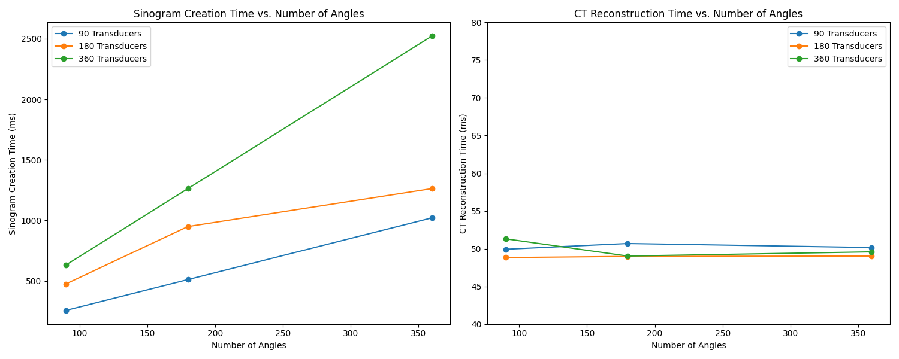
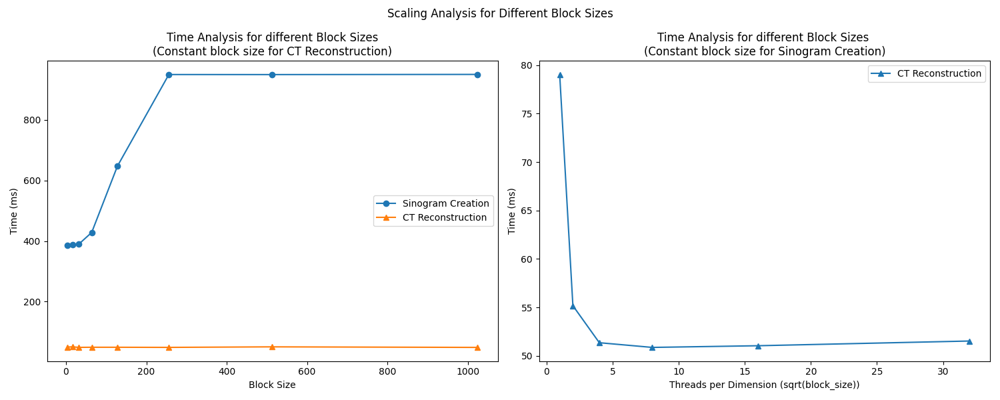

# Accelerating Computed Tomography Image Reconstruction with OpenMP and CUDA

## Team:
1. Hemanth Sridhar Nakshatri - nakshatri@wisc.edu
2. Harshil Oza - hboza@wisc.edu

## Github links:
- Public Repo: [https://github.com/hemanth-nakshatri/Accelerated-CT-Reconstruction-using-CUDA-and-OpenMP](https://github.com/hemanth-nakshatri/Accelerated-CT-Reconstruction-using-CUDA-and-OpenMP)
- Private Repo (for all commits, activity etc): [https://github.com/hemanth-nakshatri/repo759/tree/main/FinalProject](https://github.com/hemanth-nakshatri/repo759/tree/main/FinalProject) 
## 1. Introduction

Computed Tomography (CT) has become an indispensable imaging modality in various fields, most notably in healthcare for diagnostic purposes. By acquiring a series of X-ray projections from different angles, CT scans allow for the non-invasive visualization of internal structures within the human body and other objects. The resulting cross-sectional images are invaluable for identifying diseases, monitoring treatment progress, and guiding surgical procedures. Beyond medicine, CT has found applications in fields such as material science, non-destructive testing, and security screening.

However, the process of reconstructing a CT image from its raw projection data involves computationally intensive algorithms, particularly the Radon transform and backprojection. These computations can be time-consuming, especially when dealing with high-resolution images or large datasets, which limits the applicability of CT in real-time diagnostic scenarios. The need for faster image processing has therefore become a critical research area, demanding innovative solutions to reduce processing times without compromising image quality.

This project presents a parallelized CT image reconstruction pipeline that addresses these computational bottlenecks using both OpenMP for CPU multi-core parallel processing and CUDA for GPU acceleration. By optimizing the core algorithms for both CPU and GPU architectures, we aim to achieve significant performance improvements. This report will detail our methodologies, experimental results, and conclusions, offering a comprehensive overview of our efforts to enhance the performance of CT image reconstruction. Our goal is to provide a scalable and flexible solution that is capable of meeting the demands of both high-performance computing and real-time applications.

## 2. Challenges and Motivation

The field of Computed Tomography image reconstruction is primarily challenged by two major factors: the high computational cost of the underlying algorithms and the scalability issues when dealing with high-resolution images or large datasets. These challenges directly impact the speed and efficiency of CT imaging and form the core motivation for our project.

### 2.1. Computational Challenges

#### 2.1.1. High Computational Cost
The core algorithms in CT reconstruction, namely the Radon transform and backprojection, are inherently computationally intensive.
*   **Radon Transform:** The Radon transform, required for generating the sinogram, computes line integrals across different angles. For an image of size *n x n* with *k* angles and *m* transducers, the complexity of the Radon transform is approximately O(*n² k m*), which can become prohibitive as resolution and the number of angles/detectors increase.
*   **Backprojection:** The reconstruction step, known as backprojection, requires mapping the sinogram data back onto the image domain. This operation has a similar time complexity and also includes complex computations which can be a performance bottleneck.

These computations demand significant resources and can lead to slow processing times, especially when performed on traditional CPUs without optimization.

#### 2.1.2. Bilinear Interpolation
Bilinear interpolation, while crucial for accurate sampling during Radon transform and for mapping during backprojection, adds another layer of computational overhead. This is because bilinear interpolation must be performed for each point which adds to the complexity. This also limits performance because it is memory-intensive and requires several lookups.

#### 2.1.3. Sequential Processing
Naive, single-threaded implementations of these algorithms are unable to keep up with increasing demands for faster CT imaging due to sequential processing and limited computational throughput. Therefore, there was a need for parallel implementations to reduce computational times.

### 2.2. Scalability Issues

As the resolution of CT images increases, so does the computational load. Furthermore, modern CT scanners often acquire large datasets requiring processing of hundreds of images. This results in scalability challenges for traditional methods. This calls for the development of parallel implementations that can effectively utilize multi-core CPUs or GPUs to distribute the workload. This was the core reason behind building both OpenMP and CUDA versions of the code.

### 2.3. Motivation for Parallelization

Our project aims to address these challenges using parallel computing techniques.
*   **OpenMP for CPU Parallelization:** OpenMP is a tool that allows for easy parallelization of code on multi-core CPUs. This can address bottlenecks in computationally intensive parts of CT reconstruction.
*   **CUDA for GPU Acceleration:** CUDA allows for access to GPU computing power by creating custom GPU kernels. GPUs are ideal for highly parallel problems due to the large number of cores. GPUs are a better fit for CT reconstruction because the computations in backprojection can be done independantly for each pixel.
*   **Hybrid CPU-GPU Model:** We aim to utilize a hybrid CPU-GPU model by taking advantage of the benefits of each to speed up the reconstruction pipeline by performing tasks on the most suitable hardware.
*   **Real-Time Capabilities:** By combining CPU and GPU parallelism, we seek to reduce processing times significantly, enabling near real-time image reconstruction, which is crucial for clinical diagnoses and industrial applications.
*   **Flexibility and Portability:** Our goal is to develop a system that is flexible to run on a range of different hardware and can easily adapt to changes.

In summary, the main motivation behind our project is to develop a solution that is both computationally efficient and scalable for different CT reconstruction requirements. By leveraging the power of parallel programming with OpenMP and CUDA, we aim to make CT imaging faster, more accessible, and more versatile for a variety of applications.

## 3. Theoretical Background

This section provides a detailed explanation of the mathematical principles and algorithms underlying CT image reconstruction, focusing on the core concepts of the Radon transform, bilinear interpolation, ramp filtering, and backprojection. These mathematical concepts form the foundation of our project.

### 3.1. Radon Transform

The Radon transform is a fundamental mathematical tool for CT imaging, used for representing a two-dimensional image as a set of projections, which are then used for reconstruction. The Radon transform essentially calculates the line integral of an image function *f(x,y)* along a line characterized by an angle *θ* and a perpendicular distance *s* from the origin.

Mathematically, the Radon transform *R(θ, s)* is given by:

$R(θ, s) = \int\int f(x, y) \delta(x cosθ + y sinθ - s) dx dy$

where:
*   *f(x, y)* is the two-dimensional image function
*   *θ* is the angle of the line with respect to the x-axis.
*   *s* is the perpendicular distance of the line from the origin.
*   *δ* is the Dirac delta function, which ensures that the integral is only computed along the line *x cosθ + y sinθ - s = 0*.

In the context of CT, *R(θ, s)* represents the projections obtained by measuring the attenuation of X-rays passing through an object at different angles.

### 3.2. Bilinear Interpolation

Bilinear interpolation is a technique used to estimate pixel values at non-integer coordinates in the image. This is necessary in CT reconstruction during both the Radon transform and backprojection processes. In the Radon transform, we might need to compute pixel values along lines that don't fall perfectly on image pixels, whereas, in backprojection, we map projected data back onto a grid which can often have non integer coordinates.

Bilinear interpolation approximates the value of a point (x,y) using the weighted average of the four nearest surrounding pixels. If we denote the coordinates of the four closest pixels as (x1, y1), (x2, y1), (x1, y2), and (x2, y2), with corresponding intensity values c1, c2, c3, and c4, respectively, the interpolated value I(x, y) is given by:

$I(x,y) = c1*(1-f_x)(1-f_y) + c2f_x*(1-f_y) + c3*(1-f_x)f_y + c4f_x*f_y$

where:
*   $f_x = x - x1$ is the fractional part of x.
*   $f_y = y - y1$ is the fractional part of y.

### 3.3. Ramp Filtering

Ramp filtering is an essential step in CT image reconstruction for eliminating blurring and enhancing the sharp edges and details in the reconstructed image. This filter amplifies high-frequency components while suppressing low-frequency components which in effect removes blur and sharpens details in the image. In the Fourier domain the ramp filter has a magnitude equal to the magnitude of the frequency.

The ramp filter *H(f)* in the frequency domain is defined by:

$H(f) = |f|$

where *f* represents the frequency.

### 3.4. Backprojection

Backprojection is the process of reconstructing an image from its projections (the sinogram). It involves distributing the sinogram data back onto the image domain by smearing each projection back along the path from which it was acquired. The process is an approximation to the inverse Radon transform.

Mathematically, the backprojection is given by:

$f'(x, y) = \int R(\theta, x cos\theta + y sin\theta) d\theta$

where:
*   *f'(x, y)* is the reconstructed image.
*   *R(θ, s)* is the sinogram data (Radon transform).

The backprojection step involves summing the contributions of all projections for each point in the image. In our discrete implementation we have a finite set of projections across a discrete set of points and angles. The data in the sinogram is interpolated using the closest points in the sinogram and mapped to the image space. The final image is created by averaging the contributions from every angle.

## 4. Methodology

This section outlines the step-by-step methodology used for CT image reconstruction, detailing the implementation of both CPU (OpenMP) and GPU (CUDA) versions, highlighting the parallelization strategies employed.

### 4.1. General Pipeline

Our CT image reconstruction pipeline follows these general steps:

1.  **Input Image Reading:**
    *   The pipeline begins by reading a 2D input image in BMP format using custom BMP reading functions.
2.  **Grayscale Conversion:**
    *   The RGB color image is converted to a grayscale image.
        ```
        I = (R + G + B) / 3
        ```
    * This is done to reduce the complexity of the core algorithms.
3.  **Sinogram Generation (Forward Modeling):**
    *   The grayscale image is transformed into a sinogram using the Radon transform.
    *   Bilinear interpolation is employed to calculate pixel values at non-integer positions during this transformation.
4. **Ramp Filtering:**
    * The sinogram from the previous stage is then transformed to the frequency domain using FFT algorithm.
    * The ramp filter $H(f) = |f|$ is then applied to the frequency domain data.
    * The filtered data is then transformed back to the spatial domain using inverse FFT.
5.  **Image Reconstruction (Backprojection):**
    *   The image is reconstructed from the filtered sinogram data using backprojection.
    *   Bilinear interpolation is used to project the sinogram data onto the reconstructed image grid.
6.  **Output Image Writing:**
    *   The reconstructed image is saved as a BMP file using custom BMP writing functions.

### 4.2. OpenMP Implementation (CPU)

The CPU implementation uses OpenMP to parallelize the computationally intensive sections of the reconstruction pipeline. This model is designed to utilize multi-core CPU architectures and provide a scalable solution without the need for specialized hardware.

*   **Parallelization Strategy:**
    *   OpenMP's `#pragma omp parallel for` directive is used to parallelize loops during:
        *   Sinogram creation over angles and transducers.
        *   Ramp filter application over projections.
        *   Backprojection over image pixels and angles.
    *   The `collapse` clause is used to combine multiple nested loops in for parallelization.
        * This avoids overhead and is a very effective tool for CT reconstruction as the number of angles, transducers and pixels is often very large.
    *   `simd` optimization was also added for improved performance.
        *  This allowed OpenMP to use SIMD instructions to apply similar operations on a set of data in a vector instead of one element at a time.
*   **Data Management:**
    *   Input images, sinograms, and reconstructed images are stored as standard vectors.

### 4.3. CUDA Implementation (GPU)

The GPU implementation utilizes CUDA to accelerate the reconstruction process, leveraging the massive parallelism offered by modern GPUs.

*   **Kernel Design:**
     *   Separate CUDA kernels are created for:
        *   Grayscale conversion.
        *   Sinogram creation.
        *   Ramp filtering.
        *   Backprojection.
    *   Each kernel is designed to process image, sinogram, or projection data in parallel.
*   **Memory Management:**
     *   CUDA's global memory is used for image, sinogram, and reconstructed image data.
    * Data is copied from host memory to device memory before calculations and is copied back after calculations.
*   **cuFFT Library:**
    *   The cuFFT library is utilized for fast Fourier transforms in the ramp filtering step, taking advantage of hardware accelerated functions in GPU.

### 4.4. Hybrid CPU-GPU Model

Our implementation also adopts a hybrid CPU-GPU approach.
*   The computationally expensive parts of our algorithm including the ramp filter, backprojection and sinogram creation are offloaded to the GPU for faster calculation.
*   Operations such as data transfer to and from the GPU, final normalization and storage of the data to BMP image are performed on the CPU.
* The hybrid model helps optimize performance by dividing tasks based on the architecture.

This structured approach to the methodology allows for a flexible and scalable CT reconstruction pipeline that can be deployed on both CPU and GPU systems. The use of both parallel programming models is essential to understand their strengths and weaknesses in addressing the computational demands of CT imaging.

Building upon the general pipeline outlined in the previous section, this part of the methodology focuses on the implementation details of specific components.

### 4.4. Detailed Implementation of Key Algorithms

#### 4.4.1. Sinogram Generation (Radon Transform)

*   **CPU (OpenMP):**
    *   Nested loops are used to iterate over angles and transducer positions.
    *   Bilinear interpolation is performed for each sampling point along each line integral.
    *   OpenMP's `#pragma omp parallel for collapse(2)` is used to parallelize the outer loops for angles and transducers.
*   **GPU (CUDA):**
    *   A CUDA kernel is launched with each thread assigned to calculate the sinogram value for a single transducer at a given angle.
    *   Bilinear interpolation is performed within the kernel using the same approach as in the CPU version.
    *   The kernel calculates multiple line integrals using the device memory.

#### 4.4.2. Ramp Filtering

*   **CPU (OpenMP):**
    *   The implementation uses a custom FFT implementation because FFT is not readily available in standard libraries.
    *   FFT is calculated in place and uses recursion for the divide and conquer part of the algorithm.
    *   The ramp filter is applied in the frequency domain by multiplying with the magnitude of the frequency.
    *    Inverse FFT algorithm is used to go back to the time domain after ramp filtering.
    *   OpenMP is used to process multiple angles in parallel.
*   **GPU (CUDA):**
    *   cuFFT is used to perform Fast Fourier Transforms in forward and inverse directions.
    *   The ramp filter is applied in a CUDA kernel, taking advantage of GPU parallelism.
    *   The ramp filter data is prepared on the CPU side and copied to the GPU, where it is used to filter the data.

#### 4.4.3. Backprojection

*   **CPU (OpenMP):**
    *   Nested loops are used to iterate over the image pixels and projection angles.
    *   Bilinear interpolation is performed to calculate sinogram values for each projection path.
    *   OpenMP is used to parallelize loop that iterates over image pixels and angles.
*  **GPU (CUDA):**
    *   A CUDA kernel calculates the reconstructed pixel intensity using multiple threads. Each pixel of the output image is calculated in parallel.
    *   Bilinear interpolation is performed within the kernel.
    *   Shared memory and optimized memory access patterns are not explored in this implementation because it was not a priority.

#### 4.4.4. Hybrid Execution

*   CPU is used for:
    *   File reading and writing.
    *   Initial grayscale conversion.
    *   Data management.
    *   Final Normalization before saving to BMP file.
*   GPU is used for:
    *   Sinogram generation.
    *   Ramp filtering in frequency domain.
    *   Image reconstruction.

## 5. Results

This section presents the experimental results obtained from both OpenMP and CUDA implementations. We evaluate the performance of each approach using various metrics such as execution time and speedup for different parameters such as number of threads, angles, transducers, block sizes and threads per dimension. For the metrics, we mainly focus on the three key steps in the full pipeline, the *sinogram creation (forward modeling), ramp filtering, and the reconstruction (backprojection).*

### 5.1. OpenMP Results

*   **Scaling with the Number of Threads:**

    *   We notice a general decrease in compute time with increase in number of threads for all three stages.
    *   We also noticed a diminishing return when we increase the thread count beyond a certain point. This is an expected behaviour due to communication overhead between the threads.
    *   

*   **Performance with Varying Transducers and Angles:**
    *   In this part we compare the compute time for the system as the complexity of the system is increased gradually.
    *   First we experiment increasing the system complexity by increasing the number of viewing angles.
    *   With increase in the number of viewing angles, we see a continuous increase in the compute across all stages time as shown in the graph below. 
    *   
    *   Next, we do a similar experiment by increasing the number of transducers/detectors while keeping the viewing angles constant.
    *   In this experiment, we see a similar trend for the forward modeling and the ramp filter stages.
    *   However, for the CT reconstruction, although the compte time reduces with more threads, it remains almost constant with increase in the complexity.
        *   We believe it is because of the significantly higher *temporal locality* that we achieve with the way the loops are written.
    *   

### 5.2. CUDA Results
*   Similar experiments with the CUDA implementation yielded some surprising results. 
*   First, we are extremely happy that we were even able to port all of code to be CUDA compatible (seperate code files though).

    *    
    *   
*   In the above two graphs, notice the drastic difference in the compute time for the sinogram creation stage and the CT reconsttruction stage.
*   The sinogram creation (forward modeling) time is even higher than our CPU implementation.
    *   We tried to mitigate this issue, but could not get it down to match our CPU implementation.
    *   We believe the increased compute time stems from a few key factors.
        *   Large overhead and time in transfer of data between devices.
        *   Our algorithm for forward model being too sequential with the way that it's written. 
*   As for the backprojection (CT Reconstruction) part, we see a speedup of close to **1000x** compared to our CPU implementation.
* We were pleasantly surprised about these speedups and checked our timing code again to be sure that we are timing it accurately.
*   This acceleration compensated for the slowdown caused by the sinogram creation stage. The overall pipeline still achieves a **15x** speedup over our best performing CPU result.

### 5.3. Qualitative Results

*   **Reconstructed Images:**
    *   
    *   The above image represents different sinograms and reconstructions using different configurations/complexity.
    *   The lines or artifacts that we see are due to reduced complexity of the model when either the number of viewing angles or detectors are less than ideal.
*   **Ramp Filter necessity:**
    *   
    *   Here, we see a comparison of the pipeline with and without the Ramp Filter.
    *   Without ramp filter, we see that the result is extremely hazy with no important details highlighted.
    * But with ramp filter, we see a really sharp high contrast result.
    * This justifies the need for the ramp filter even with the added compute burden.

## 6. Conclusion

In this project, we have successfully implemented a parallelized CT image reconstruction pipeline that leverages both OpenMP for multi-core CPU processing and CUDA for GPU acceleration. The results clearly demonstrate the effectiveness of both techniques in reducing processing times for CT reconstruction, thereby making it much more efficient and scalable than a naive implementation.

Key outcomes of this project include:

*   **OpenMP Acceleration:** Achieved a significant performance improvement for sinogram creation, ramp filtering and backprojection tasks on multi-core CPUs using OpenMP.
*   **CUDA Acceleration:** Realized substantial speedups, approximately 1000x for backprojection, through the use of CUDA on a GPU, highlighting the potential of GPU computing for computationally intensive tasks.
*   **Hybrid Approach:** Successfully created a hybrid CPU-GPU approach, which combined the strengths of both by offloading the most intensive parts of the reconstruction to the GPU, and using the CPU for initial preprocessing, file handling, and final normalization.
*   **Custom BMP Handling:** Demonstrated the feasibility of creating portable custom solutions, eliminating external dependencies by using custom methods for BMP reading and writing.

Our work shows the importance of parallel implementations using both CPU and GPU as a means for creating faster and more scalable solutions.

## 8. Takeaways

The project highlighted the following key learnings and takeaways:

*   **Hybrid Models are Effective:** Combining CPU and GPU resources provides optimal performance for different types of operations.
*   **Collaboration is Essential:** Breaking down the problem into smaller modules simplified debugging, and brainstorming helped find effective solutions to issues that came up during implementation.
*   **Scalable Design:** The use of custom solutions makes the project easily portable across different platforms and can easily adapt to any changes made to the workflow.
*  **Importance of Code Optimization:** Optimization of memory access patterns and memory management techniques are crucial to achieve peak performance.

## 7. Disclaimer

It is important to acknowledge that in the development of this project, we utilized Large Language Models (LLMs) such as ChatGPT and Claude for certain aspects. Specifically:

*   **Code Generation:** Small portions of the code, including some of the utility functions and testing/evaluation scripts, were generated with the assistance of LLMs.
*   **Debugging:** LLMs, specifically ChatGPT, were used to assist in debugging parts of the code and address issues encountered during implementation.
*   **Report Review:** ChatGPT was also utilized for proofreading and suggesting revisions to this report.

While these LLMs provided valuable assistance, the core logic, design, and analysis of this project were done independently. All final code and results were verified and tested by us to ensure accuracy and validity. We believe it is important to be transparent about our use of these tools, and we acknowledge the contributions they provided to our project.


## 8. References

1.  **Kak, A. C., & Slaney, M. (2001).** *Principles of computerized tomographic imaging.* Society of Industrial and Applied Mathematics.
    *   This is a comprehensive textbook covering the fundamental principles of CT, including the Radon transform and backprojection.

2.  **Deans, S. R. (2007).** *The Radon transform and some of its applications.* Courier Corporation.
    *   A detailed exploration of the Radon transform, its mathematical properties, and applications in various fields.

3.  **Barrett, H. H., & Myers, K. J. (2004).** *Foundations of image science.* John Wiley & Sons.
    *   A detailed exploration of image science, including discussions about the physics behind imaging and different reconstruction techniques.

4. **The Radon Transform: A Basic Principle** - Towards Data Science
[https://towardsdatascience.com/the-radon-transform-basic-principle-3179b33f773a](https://towardsdatascience.com/the-radon-transform-basic-principle-3179b33f773a)
    * A good article about the basic concepts behind Radon Transforms

5. **EPFL Abstract- Parallel Beam CT**
[https://bigwww.epfl.ch/teaching/projects/abstract.html?f=00359](https://bigwww.epfl.ch/teaching/projects/abstract.html?f=00359)
    * A good document to understand the mathematical notations used in the field of CT reconstruction.